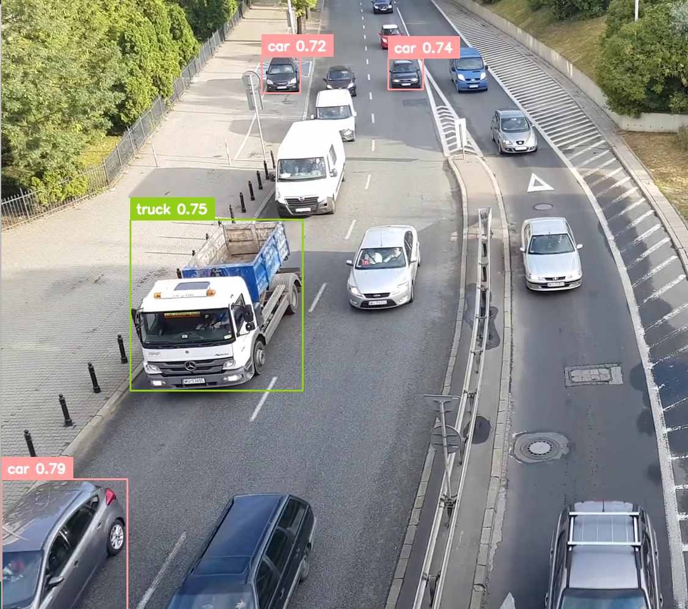
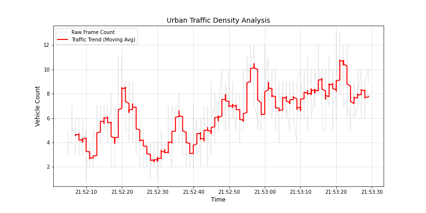
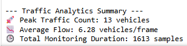

# 🚦 Urban Traffic Vision: Real-Time Analytics Engine

## 📌 Project Overview
**Urban Traffic Vision** is an end-to-end computer vision and data analytics pipeline designed for smart-city infrastructure monitoring. By leveraging the **YOLOv8** object detection framework, the system transforms raw traffic footage into actionable urban mobility insights.

The project goes beyond simple detection, implementing data smoothing algorithms to provide clear temporal density trends, helping urban planners identify peak congestion patterns and bottleneck triggers.

---

## 🛠️ Tech Stack
* **Core Model:** Ultralytics YOLOv8
* **Vision Logic:** OpenCV & Supervision (v0.24+)
* **Data Science:** Pandas & NumPy
* **Visualization:** Matplotlib
* **Language:** Python 3.10+

---

## 🚀 Key Technical Features
* **Real-Time Vehicle Detection:** Utilizes YOLOv8 (Nano) for high-speed classification of cars, buses, trucks, and motorcycles.
* **Advanced Noise Mitigation:** Implements Non-Maximum Suppression (NMS) and custom confidence thresholds to eliminate duplicate detections and environmental false positives like manholes.
* **Temporal Data Analytics:** Aggregates frame-by-frame detections into a structured time-series dataset.
* **Moving Average Smoothing:** Employs a rolling average algorithm to transform high-frequency, "noisy" frame data into professional-grade trend visualizations.
* **Automated KPI Reporting:** Generates summary statistics including Peak Traffic Count and Average Vehicle Flow.

---

## 📊 Visual Insights

### 1. Real-Time Detection & Classification
The system accurately identifies and labels multiple vehicle classes simultaneously with high confidence.



### 2. Traffic Density Analysis
Raw detection data often contains rapid fluctuations. By applying a **Moving Average (30-frame window)**, we extract a clean "Traffic Trend" that represents true congestion levels.




### 3. Analytics Summary
The pipeline automatically exports metrics to a CSV and generates a final status report for stakeholders.



---

## 📥 Installation & Usage

1. **Clone the repository:**
   ```
   git clone https://github.com/Rahilshah01/urban-traffic-vision-yolov8.git
   ```
2. **Install dependencies:**
   ```
   pip install ultralytics supervision opencv-python pandas matplotlib
   ```
3. **Run the analysis:** Place your footage in the ```data/``` folder and run jupyter notebook: 
   ```
   traffic_main.ipynb
   ```
---
